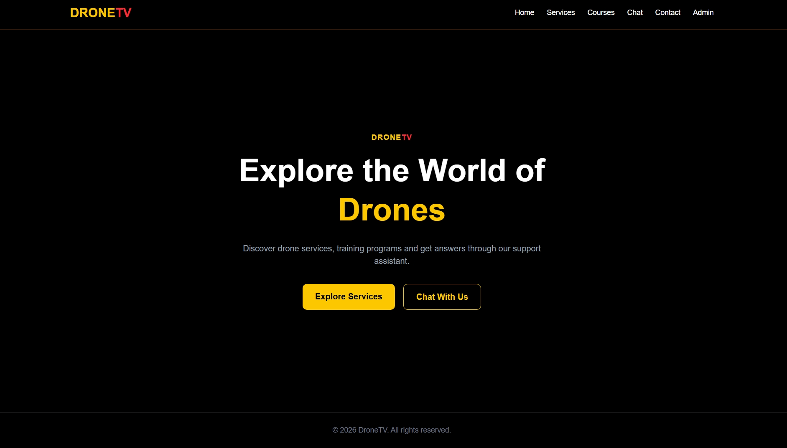
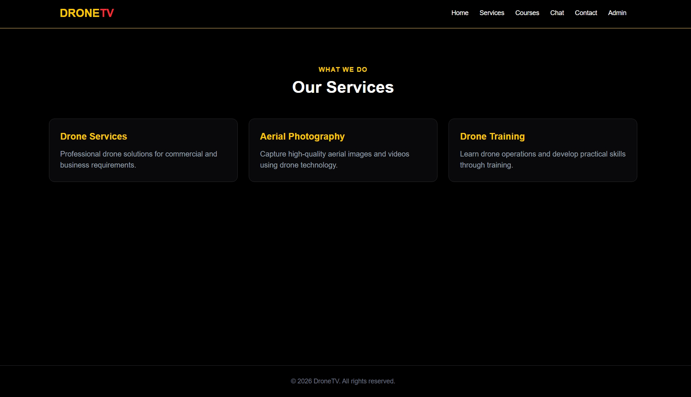
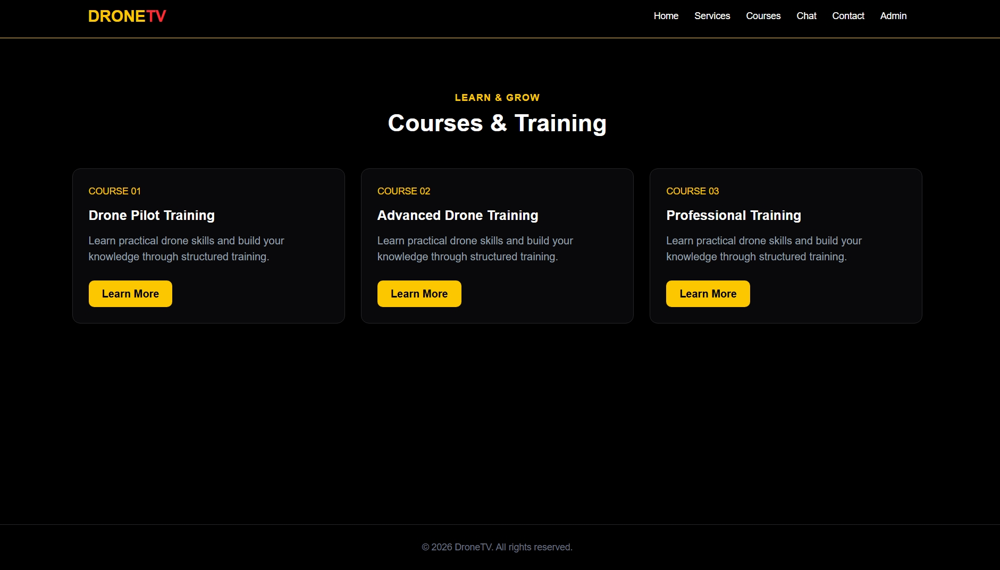
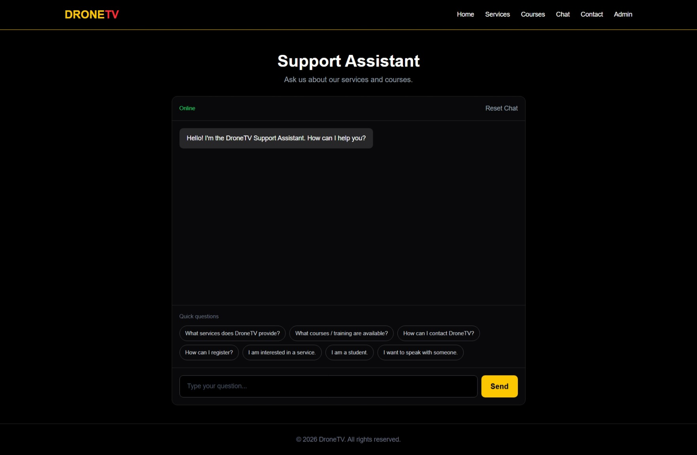
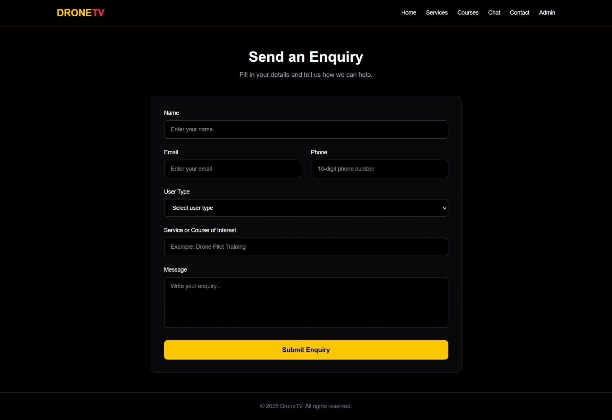
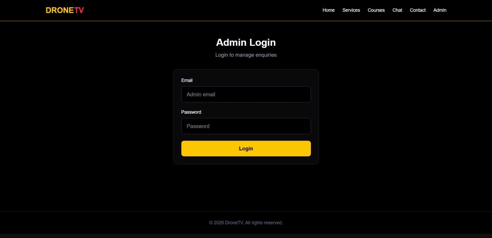
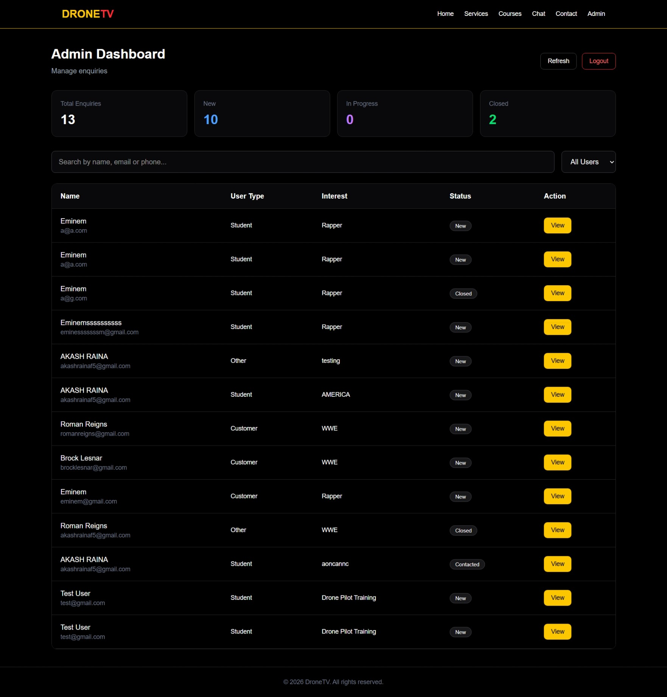
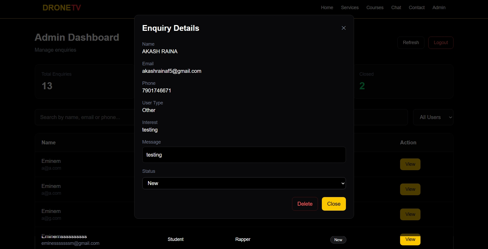

# DroneTV — Full-Stack Support Chatbot & Enquiry Management Platform

A full-stack **TypeScript** web application built for a drone services & training company ("DroneTV"). It combines a public marketing site with a built-in **support chatbot**, a validated **enquiry (lead) form**, and a secure, cookie-authenticated **admin dashboard** for managing every enquiry that comes in.

> Repository: [`Champion7771/FullStack_Chatbot_Task_Akash_Raina`](https://github.com/Champion7771/FullStack_Chatbot_Task_Akash_Raina)
> Live frontend: [full-stack-chatbot-task-akash-raina.vercel.app](https://full-stack-chatbot-task-akash-raina.vercel.app) *(as configured in the backend's CORS origin — the API itself is hosted separately)*


## Table of Contents

- [Overview](#-overview)
- [Features](#-features)
- [How the Chatbot Works](#-how-the-chatbot-works)
- [Tech Stack](#-tech-stack)
- [Project Structure](#-project-structure)
- [API Reference](#-api-reference)
- [Data Models](#-data-models)
- [Getting Started](#-getting-started)
- [Environment Variables](#-environment-variables)
- [Available Scripts](#-available-scripts)
- [Security](#-security)
- [Known Limitations](#-known-limitations--notes)
- [Roadmap](#-roadmap)
- [Screenshots](#-screenshots)
- [Author](#-author)
- [License](#-license)


## Overview

DroneTV is a fictional drone-services and training company. This project delivers its complete web presence in one repository:

- A **public site** (`Client`) where visitors can browse services and courses, chat with an automated support assistant, and submit an enquiry.
- A **REST API** (`Backend`) that stores enquiries in MongoDB, validates and sanitizes every submission, and exposes an authenticated admin surface.
- An **admin dashboard**, gated behind login, where staff can search, filter, review, update, and delete incoming enquiries.

The two halves are fully decoupled — the `Client` is a Vite/React single-page app that talks to the `Backend` purely over its JSON REST API.

## Features

**Visitor-facing**
- Responsive marketing pages — Home, Services, Courses — with a collapsible hamburger menu on mobile
- Support Assistant chatbot with quick-question shortcuts and a chat reset button
- Enquiry / Contact form with live client-side validation and a success confirmation

**Admin-facing**
- Email + password login, session handled via a signed JWT in an httpOnly cookie(email-admin@dronetv.com, password-admin123)
- Dashboard summary cards — Total, New, In Progress, Closed enquiry counts
- Search by name/email/phone and filter by user type (Student / Customer / Other)
- Enquiry detail modal — read the full message, change status, or delete the record
- Logout

## How the Chatbot Works

The **Support Assistant** on `/chatbot` is a lightweight, fully client-side **rule-based chatbot** — it does not call an LLM or any external AI API. `Chatbot.tsx` lower-cases each message and checks it against keyword sets (`services`, `course`/`training`, `contact`, `register`, `interested`, `student`, `speak`), returning a canned response for the first match and a generic fallback otherwise. Seven "quick question" buttons are provided so visitors can trigger a good response without typing. Because the matching logic lives in one pure function (`getBotResponse`), it can be swapped for a real AI/LLM-backed endpoint later without touching the chat UI itself.

## Tech Stack

**Frontend (`Client`)**

| Library | Purpose |
|---|---|
| React 19 + TypeScript | UI framework |
| Vite | Dev server & build tool |
| React Router v7 | Client-side routing |
| Tailwind CSS v4 | Styling |
| Axios | HTTP client (with `withCredentials` for cookie auth) |
| DOMPurify | Client-side input sanitization |
| lucide-react | Icons |

**Backend (`Backend`)**

| Library | Purpose |
|---|---|
| Node.js + Express 5 + TypeScript | REST API server |
| Mongoose 9 / MongoDB | Data persistence |
| jsonwebtoken | Admin session tokens |
| bcryptjs | Password hashing |
| cookie-parser | Reading the httpOnly auth cookie |
| cors | Cross-origin access control |
| @exortek/express-mongo-sanitize | NoSQL injection protection |
| dotenv | Environment configuration |

**Dev tooling:** `tsx` (hot-reloading TS execution), `nodemon`, ESLint + `typescript-eslint`.

## Project Structure

```
FullStack_Chatbot_Task_Akash_Raina/
├── Backend/
│   ├── src/
│   │   ├── config/
│   │   │   ├── db.ts              # MongoDB connection
│   │   │   └── dns.ts             # Forces Google/Cloudflare DNS resolvers
│   │   ├── controllers/
│   │   │   ├── authController.ts  # Admin login / logout
│   │   │   └── enquiryController.ts
│   │   ├── middleware/
│   │   │   ├── authMiddleware.ts       # JWT cookie verification
│   │   │   ├── errorMiddleware.ts      # Centralized error handler
│   │   │   └── validationMiddleware.ts # Enquiry payload validation
│   │   ├── models/
│   │   │   ├── Admin.ts
│   │   │   └── enquiryModel.ts
│   │   ├── routes/
│   │   │   ├── authRoutes.ts
│   │   │   └── enquiryRoutes.ts
│   │   ├── types/
│   │   │   ├── enquiryTypes.ts
│   │   │   └── express.d.ts       # Adds `req.user` typing
│   │   ├── app.ts                 # Express app + middleware wiring
│   │   ├── server.ts              # Entry point
│   │   └── createAdmin.ts         # One-off script to seed an admin user
│   ├── package.json
│   └── tsconfig.json
│
└── Client/
    ├── src/
    │   ├── api/
    │   │   └── axios.ts           # Preconfigured Axios instance
    │   ├── components/
    │   │   ├── Navbar.tsx
    │   │   ├── Footer.tsx
    │   │   └── ProtectedAdmin.tsx # Route guard for /admin
    │   ├── pages/
    │   │   ├── Home.tsx
    │   │   ├── Services.tsx
    │   │   ├── Courses.tsx
    │   │   ├── Chatbot.tsx
    │   │   ├── Contact.tsx
    │   │   ├── AdminLogin.tsx
    │   │   ├── Admin.tsx
    │   │   └── ViewEnquiry.tsx
    │   ├── App.tsx                # Route definitions
    │   └── main.tsx                # App entry point
    ├── package.json
    └── vite.config.ts
```

## API Reference

Base URL: `http://localhost:5000/api`

| Method | Endpoint | Access | Description |
|---|---|---|---|
| `GET` | `/` *(root, no `/api` prefix)* | Public | Health check — confirms the API is running |
| `POST` | `/auth/login` | Public | Admin login; on success sets an httpOnly `adminToken` cookie |
| `POST` | `/auth/logout` | Public | Clears the `adminToken` cookie |
| `POST` | `/enquiries` | Public | Submit a new enquiry (validated + sanitized server-side) |
| `GET` | `/enquiries` | Admin | List all enquiries, newest first; optional `?status=` filter |
| `GET` | `/enquiries/:id` | Admin | Get a single enquiry by ID |
| `PATCH` | `/enquiries/:id` | Admin | Update an enquiry's `status` |
| `DELETE` | `/enquiries/:id` | Admin | Delete an enquiry |

Admin-only routes require a valid `adminToken` cookie (set automatically by the browser after login) carrying a JWT with `role: "admin"`.

## Data Models

**Admin**

| Field | Type | Notes |
|---|---|---|
| `email` | String | required, unique |
| `password` | String | required, bcrypt-hashed |
| `role` | String | defaults to `"admin"` |
| `createdAt` / `updatedAt` | Date | auto (timestamps) |

**Enquiry**

| Field | Type | Notes |
|---|---|---|
| `name` | String | required |
| `email` | String | required |
| `phone` | String | required, validated as 10 digits |
| `userType` | String | required — `Student`, `Customer`, or `Other` |
| `interest` | String | required — service or course of interest |
| `message` | String | required |
| `status` | String enum | `New` \| `Contacted` \| `In Progress` \| `Closed`, defaults to `New` |
| `createdAt` / `updatedAt` | Date | auto (timestamps) |

*(The `EnquiryStatus` TypeScript type and the Mongoose enum are now consistent — both use `"Closed"`.)*

## Getting Started

### Prerequisites
- Node.js 20+ and npm
- A MongoDB database — a local `mongod` instance or a free [MongoDB Atlas](https://www.mongodb.com/atlas) cluster
- Git

### 1. Clone the repository
```bash
git clone https://github.com/Champion7771/FullStack_Chatbot_Task_Akash_Raina.git
cd FullStack_Chatbot_Task_Akash_Raina
```

### 2. Set up the backend
```bash
cd Backend
npm install
```

Create a `.env` file inside `Backend/`:
```env
PORT=5000
MONGO_URI=your_mongodb_connection_string
JWT_SECRET=your_long_random_secret
```

Start the API in watch mode:
```bash
npm run dev
```
The server starts on `http://localhost:5000` (health check at `GET /`).

> **Note:** `Backend/src/app.ts` currently sets the CORS `origin` to the deployed Vercel URL. For local development, temporarily change it back to `http://localhost:5173` (and set the login cookie's `sameSite` to `"lax"` / `secure` to `false`), or read both from an environment variable so local and deployed origins can coexist.

### 3. Seed an admin account
The dashboard needs at least one admin in the database. From inside `Backend/`, run:
```bash
npx tsx src/createAdmin.ts
```
This creates a default admin:
- **Email:** `admin@dronetv.com`
- **Password:** `admin123`

Change this password (or edit `createAdmin.ts` before running it) — never keep the default credentials in a real deployment.

### 4. Set up the frontend
In a new terminal:
```bash
cd Client
npm install
```

Create a `.env` file inside `Client/`:
```env
VITE_API_URL=http://localhost:5000/api
```

Then start the dev server:
```bash
npm run dev
```
The app opens at `http://localhost:5173` (Vite's default port).

### 5. Try it out
- Visit `http://localhost:5173` for the public site and chatbot.
- Go to `/contact` to submit a test enquiry.
- Go to `/admin-login`, sign in with the seeded admin account, and manage enquiries at `/admin`.

### Deployment

The live version of this project runs the frontend on **Vercel** (see `Client/vercel.json`, which rewrites all routes to `index.html` so client-side routing works on refresh/deep-links) and the backend on a separate host. For your own deployment:
- Set `VITE_API_URL` in the frontend's hosting provider to your deployed API's base URL (e.g. `https://your-api.example.com/api`).
- Set `origin` in `Backend/src/app.ts`'s CORS config to your deployed frontend's URL.
- Because the frontend and backend live on different domains in production, the auth cookie is set with `secure: true, sameSite: "none"` — this requires the backend to be served over **HTTPS**.

## Environment Variables

Only the backend currently reads environment variables:

| Variable | Required | Default | Description |
|---|---|---|---|
| `PORT` | No | `5000` | Port the Express server listens on |
| `MONGO_URI` | Yes | — | MongoDB connection string used by Mongoose |
| `JWT_SECRET` | Yes | — | Secret key used to sign and verify admin JWTs |

The frontend reads its own variable via Vite: create a `.env` file inside `Client/` with:
```env
VITE_API_URL=http://localhost:5000/api
```
`Client/src/api/axios.ts` uses this for its Axios `baseURL` (and always sends `withCredentials: true` for the auth cookie). Point it at your deployed API's URL when building for production.

## Available Scripts

**Backend**

| Script | Command | Description |
|---|---|---|
| `npm run dev` | `tsx watch src/server.ts` | Run the API with auto-reload |
| `npm run build` | `tsc` | Compile TypeScript to `dist/` |
| `npm start` | `node dist/server.js` | Run the compiled server (after `build`) |

**Client**

| Script | Command | Description |
|---|---|---|
| `npm run dev` | `vite` | Start the Vite dev server |
| `npm run build` | `tsc -b && vite build` | Type-check and build for production |
| `npm run lint` | `eslint .` | Lint the codebase |
| `npm run preview` | `vite preview` | Preview the production build locally |

## Security

- Passwords are hashed with **bcryptjs** — never stored or compared in plain text.
- Admin sessions use a **JWT stored in an httpOnly cookie** (`secure: true`, `sameSite: "none"` in production, to support the frontend and API being on different domains), so the token itself is never exposed to client-side JavaScript.
- **`express-mongo-sanitize`** strips MongoDB operator injection (`$`, `.`) from all incoming request data.
- Every enquiry submission passes through **server-side field validation** (`validationMiddleware.ts`) and a **tag-stripping sanitizer** before it's saved.
- The contact form also runs input through **DOMPurify** on the client before it's ever sent.
- **CORS** is restricted to a single trusted origin with credentials enabled.
- All enquiry read/update/delete routes are gated behind `adminAuth` middleware — only creating an enquiry is public.

## Known Limitations / Notes

The project has since been deployed and hardened — most of the auth/URL issues below were fixed in a follow-up round of commits. What's left is:

- **`ProtectedAdmin.tsx` is now dead code.** It still checks `localStorage.getItem("adminToken")` (which nothing ever sets) and would incorrectly block access if it were used — but `App.tsx` no longer routes `/admin` through it, so it currently has no effect. `Admin.tsx` itself handles auth correctly: it trusts the httpOnly cookie and redirects to `/admin-login` on a `401`/`403` from the API. Safe to delete `ProtectedAdmin.tsx`, or wire it up properly and remove the redundant client-side check.
- **Compiled backend output is committed.** `Backend/dist/**` (the `tsc` build output) is checked into git rather than `.gitignore`d — likely a side effect of the deployment setup. Worth excluding and letting the build step regenerate it.
- **Chatbot is rule-based, not AI-powered** — it recognizes a fixed set of keywords and returns a generic fallback for anything else.
- **Default admin credentials** created by `createAdmin.ts` (`admin@dronetv.com` / `admin123`) should be changed on any environment beyond local testing.
- No automated tests are included yet.

**Already fixed since the initial submission** (for reference, in case you're looking at an older clone):
- ~~Admin route guard relied on a `localStorage` token that was never set~~ → `Admin.tsx` now checks the httpOnly cookie via the API response instead.
- ~~API base URL hardcoded to `localhost`~~ → now read from `VITE_API_URL`.
- ~~CORS locked to `localhost:5173`~~ → now points at the deployed Vercel origin, with the auth cookie updated to `secure: true, sameSite: "none"` for cross-site use.
- ~~No mobile navigation~~ → `Navbar.tsx` now includes a working hamburger menu.
- ~~`enquiryTypes.ts` said `"Resolved"`, schema/UI said `"Closed"`~~ → both now use `"Closed"`.

## Roadmap

- [ ] Remove or properly wire up the unused `ProtectedAdmin.tsx` guard
- [ ] Stop committing `Backend/dist/` — add it to `.gitignore`
- [ ] Add pagination and sorting to the admin enquiries table
- [ ] Add unit/integration tests (backend routes, chatbot response logic)
- [ ] Connect the chatbot to a real AI/LLM endpoint (optional upgrade)
- [ ] Add CI (lint + build) on top of the existing Vercel deployment

## Screenshots

Create a `screenshots/` folder at the repository root and capture the pages below at a reasonably wide viewport (≥1280px) so text and layout stay crisp. Suggested filenames are shown so the embeds below work as-is once you drop the images in.

| # | Screenshot | Suggested filename | What to capture |
|---|---|---|---|
| 1 | Homepage | `screenshots/home.png` | The hero section with the DroneTV headline and "Explore Services" / "Chat With Us" buttons |
| 2 | Services page | `screenshots/services.png` | The three service cards |
| 3 | Courses page | `screenshots/courses.png` | The course cards with "Learn More" buttons |
| 4 | Chatbot conversation | `screenshots/chatbot.png` | The Support Assistant mid-conversation — a couple of exchanged messages plus the "Quick questions" chips, to show the bot actually answering |
| 5 | Contact form — submitted | `screenshots/contact-form.png` | The enquiry form filled in, ideally with the green "submitted successfully" confirmation banner visible |
| 6 | Admin login | `screenshots/admin-login.png` | The `/admin-login` page |
| 7 | Admin dashboard | `screenshots/admin-dashboard.png` | The stat cards (Total/New/In Progress/Closed) and the enquiries table, ideally with a few rows in different statuses so the colored counts are meaningful |
| 8 | Enquiry detail modal | `screenshots/admin-enquiry-modal.png` | The "Enquiry Details" popup, showing the message, the status dropdown, and the Delete/Close buttons |
| 9 *(optional)* | Mobile view | `screenshots/mobile-view.png` | Home or Chatbot page at mobile width, to demonstrate responsiveness |


## Screenshots

    


   

    

## Author

**Akash Raina**
GitHub: [@Champion7771](https://github.com/Champion7771)

## License

No license file is currently included in this repository. If you intend to share or open-source this project, consider adding one (e.g., the [MIT License](https://choosealicense.com/licenses/mit/)).
